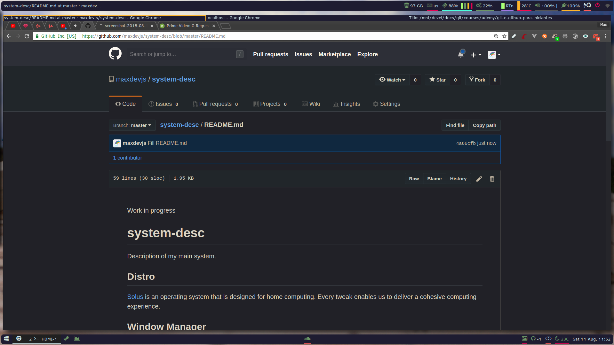

# system-desc

Description of my main system.

<!--  -->

## System

### Distro

[Solus](https://solus-project.com/) is an operating system that is designed for home computing. Every tweak enables us to deliver a cohesive computing experience.

### Window Manager

#### In use

[i3wm](https://i3wm.org/) is a tiling window manager ( [i3-gaps](https://github.com/Airblader/i3) version is [Solus](https://solus-project.com/)'s default)

### Desktop Environment

#### Installed

Sometimes using a few components, otherwise ignored.

[Budgie](<https://en.wikipedia.org/wiki/Budgie_(desktop_environment)>) feature-rich, luxurious desktop using the most modern technologies.

[Mate](<https://en.wikipedia.org/wiki/MATE_(software)>) traditional desktop for advanced users and older hardware.

### Bar

[Polybar](https://github.com/jaagr/polybar) is a fast and easy-to-use tool for creating status bars.

### Launcher & C.

[Rofi](https://github.com/DaveDavenport/rofi) a window switcher, application launcher and dmenu replacement

### X11 Compositor

[Compton](https://github.com/chjj/compton) is a compositor for X, and a fork of xcompmgr-dana.

## Software

### Text Editor

#### In use

[neovim](https://neovim.io/) literally the future of vim

#### Installed

[VSCode](https://code.visualstudio.com/)

[Sublime Text](https://www.sublimetext.com/) a sophisticated text editor for code, markup and prose

## File Browser

[Ranger](<https://en.wikipedia.org/wiki/Ranger_(file_manager)>) is a free and open-source file manager with text-based user interface for Unix-like systems.

[Nautilus](https://en.wikipedia.org/wiki/GNOME_Files) GNOME Files, formerly and internally known as Nautilus, is the official file manager for the GNOME desktop (and [Budgie](<https://en.wikipedia.org/wiki/Budgie_(desktop_environment)>)).

### Terminal

#### In use

[Tilix](https://gnunn1.github.io/tilix-web/) is an advanced GTK3 tiling terminal emulator that follows the Gnome Human Interface Guidelines.

#### Installed

[Gnome Terminal](https://en.wikipedia.org/wiki/GNOME_Terminal) is a terminal emulator for the GNOME desktop environment written by Havoc Pennington and others. Terminal emulators allow users to access a UNIX shell while remaining on their graphical desktop.

[Mate Terminal](<https://en.wikipedia.org/wiki/MATE_(software)>) terminal emulator (from GNOME Terminal)

## Dotfiles

[Soon, maybe](#)
